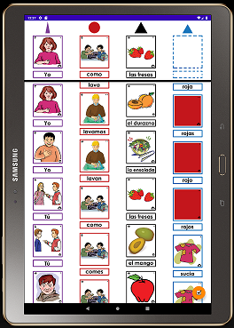

# MontessoriSpanish Sentence App
Copyright 2020 Marco Costa
## Single Sentence Prototype

This application is a proof of concept prototype. It is one activity in a  
much larger Mobile-Assisted Language Learning (MALL) tool designed for  
self-guided Second Language (L2) grammar practice in Montessori elementary schools.

You can watch the following videos to understand the pedagogical foundation  
as well as the development process for this tool:
- [Pedagogy](https://youtu.be/6Me3dQJOzdc)
- [Activity structure and design](https://youtu.be/5dAVgHNxMhE)
- [Alpha Overview](https://youtu.be/fsCOiN2IWfc)
- Beta Overview:

### Built With:
- Android Studio 3.6 - IDE
- Kotlin - Language
- Git - VCS
- Gradle - Build Automation & Dependency Management
- PhotoShop - Asset Design

## Installation Instructions

### Android Installation

1. Navigate to this page from your Chrome browser on your Android device.
2. Next click the following link: [APK Download](app-debug.apk)

### PC Installation